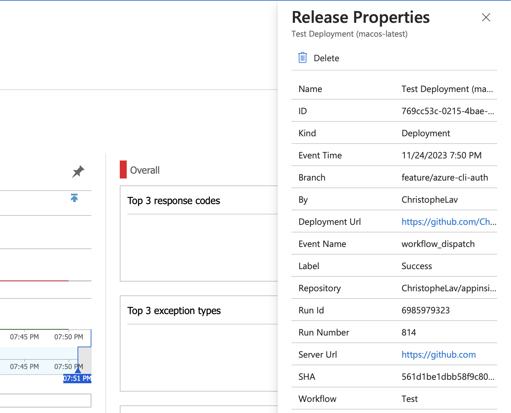

# Application Insights Annotate action

[](https://github.com/ChristopheLav/appinsights-annotate/actions/workflows/ci.yml) [](https://github.com/ChristopheLav/appinsights-annotate/actions/workflows/test.yml)

This action collect run metadata and publish a deployment annotation to Application Insights that allow to track deployments.

You need to set an annotation name, but the extension also publish automatically these properties:
- `Label` with `Success` or `Error`
- `Server Url` with value of `${{ github.server_url }}`
- `Repository` with value of `${{ github.repository }}`
- `Workflow` with value of `${{ github.workflow }}`
- `Run Id` with value of `${{ github.run_id }}`
- `Run Number` with value of `${{ github.run_number }}`
- `Branch` with value of `${{ github.ref_name }}`
- `SHA` with value of `${{ github.sha }}`
- `By` with value of `${{ github.actor }}`
- `Event Name` with value of `${{ github.event_name }}`
- `Deployment Url` with value of `https://github.com/${{ github.repository }}/commit/${{ github.sha }}/checks`



## What's new

Refer [here](CHANGELOG.md) to the changelog.

Breaking change of the V2: 
- removed support of the Application Insights API keys [deprecated by Microsoft](https://learn.microsoft.com/en-us/azure/azure-monitor/app/release-and-work-item-insights?tabs=release-annotations#create-release-annotations-with-the-azure-cli)
- you now need to use the Azure Login action before the use of this action to handle the Azure authentication
- the v1 of the action will stop to work by 31 August 2024 due to this depreciation

## Configuration

It is necessary to use the [Azure Login action](https://github.com/marketplace/actions/azure-login) before to use this action.

Put your values into GitHub secrets to prevent clear value in your workflow.

```yaml
- uses: azure/login@v1
  with:
    client-id: ${{ secrets.AZURE_CLIENT_ID }}
    tenant-id: ${{ secrets.AZURE_TENANT_ID }}
    subscription-id: ${{ secrets.AZURE_SUBSCRIPTION_ID }}
```

## Usage

<!-- start usage -->
```yaml
- uses: ChristopheLav/appinsights-annotate@v2
  with:
    # The `Application ID` of the Application Insights resource (available in the
    # Azure Portal under `API Access`).
    app-id: ''

    # Name of your deployment. You can set the version number or use the value
    # `github.event.head_commit.message` to set the last commit message.
    name: ''

    # Indicates if the deployment is in success.
    # Default: true
    is-deployment-succeed: true

    # Allows to treat error as warning to prevent worlflow failure. It is may not
    # important in some cases if the annotation can not be created.
    # Default: false
    treat-error-as-warning: false
```
<!-- end usage -->

## License

The scripts and documentation in this project are released under the [MIT License](LICENSE)